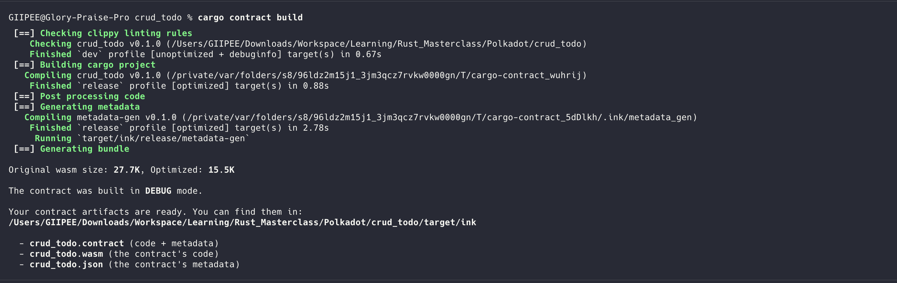
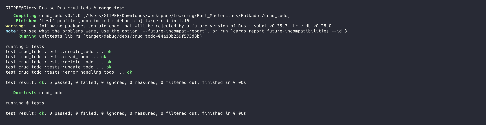

# Simple CRUD Todo Smart Contract

A minimal todo list smart contract built with ink! v5 for Polkadot.

## Features

- ✅ Create new todos with auto-incrementing IDs
- ✅ Read todos by ID
- ✅ Update todo title and completion status
- ✅ Delete todos
- ✅ Simple boolean status tracking (completed/not completed)

## Build

Compile the smart contract:

```bash
cargo contract build
```
## Build Example


## Test

Run the unit tests:

```bash
cargo test
```

## Test Example


## Development

### Check contract

```bash
cargo check
```

